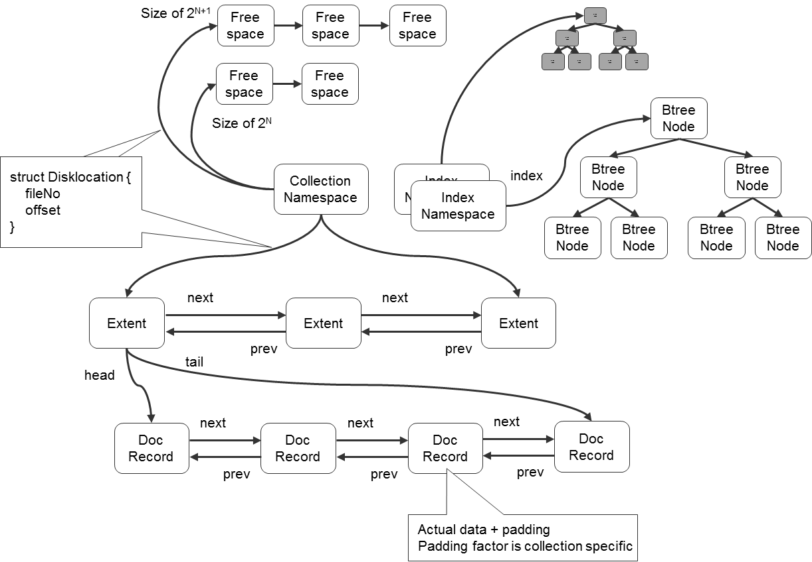
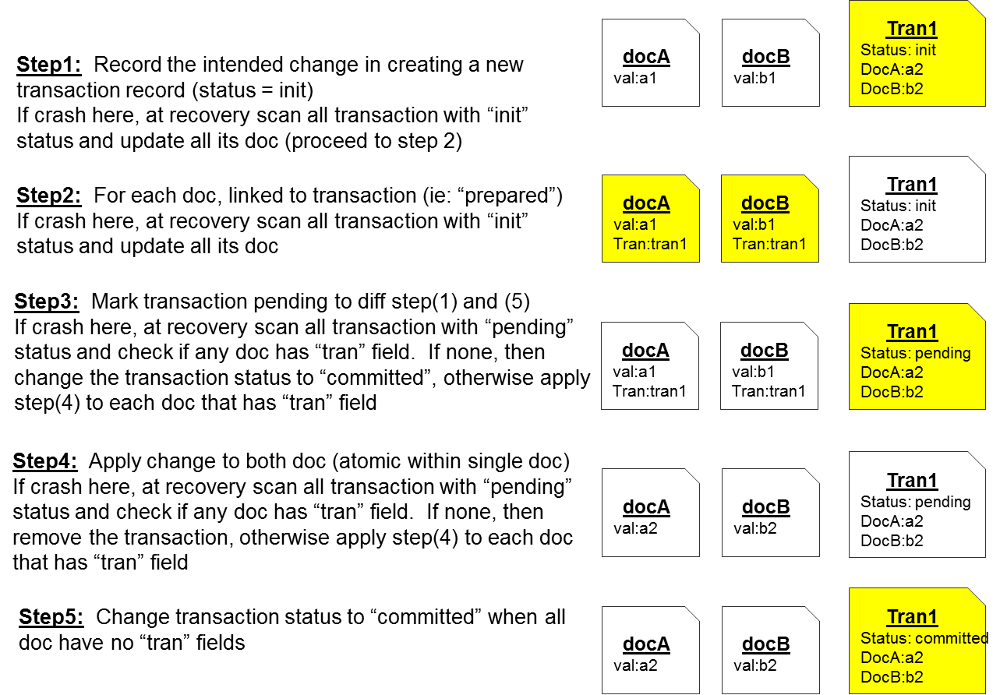
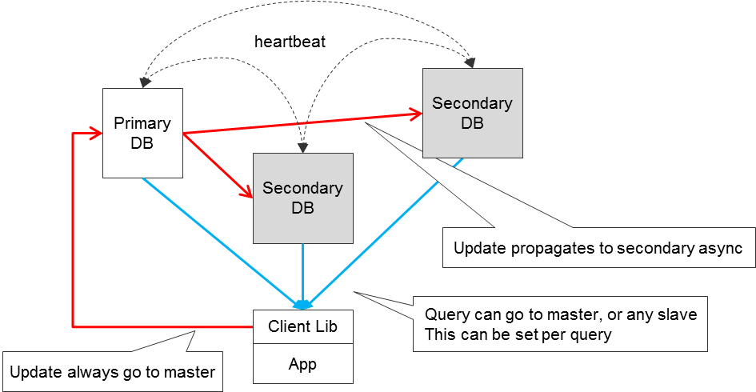
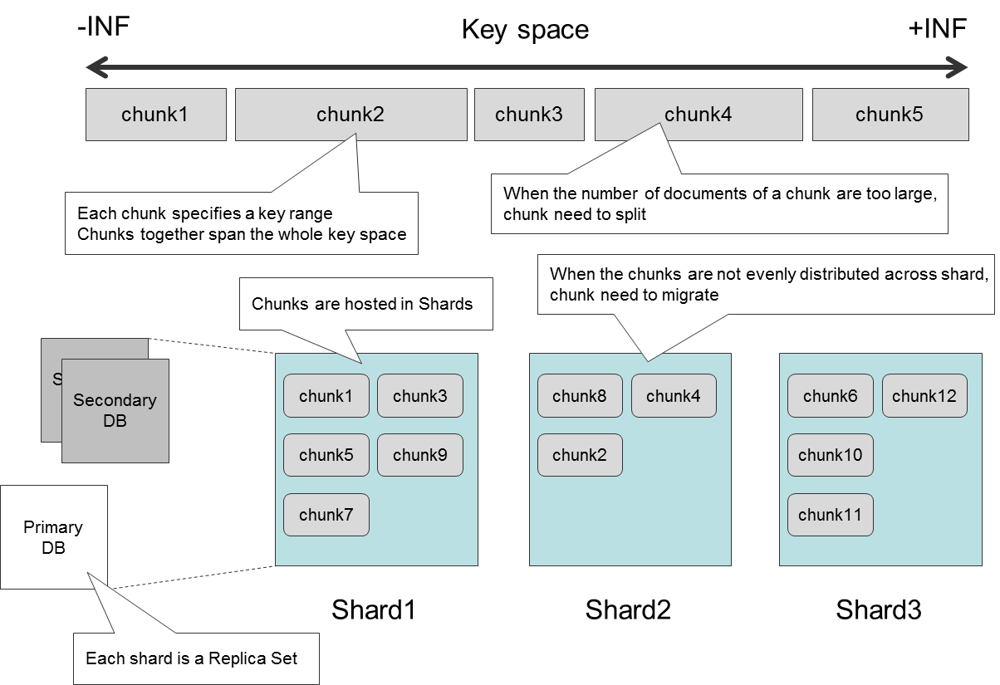
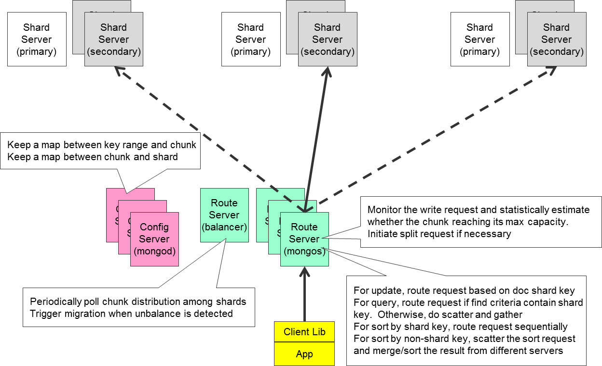

#MangoDB 架构 ／ MongoDB Architecture

###### Author Ricky Ho | Date 2012-04-02 | [ Raw ](https://horicky.blogspot.jp/2012/04/mongodb-architecture.html)

NOSQL 是目前大型网络规模部署（web-scale 基础架构）的一个热门话题，可扩展能力以及半结构化的数据都驱使数据库技术需求向 NOSQL 技术转移。在过去十多年的时间里，业内发展出了许多 NOSQL 产品。我在之前的[ 博客 ](https://horicky.blogspot.jp/)里也讲解过 NOSQL 的底层分布式系统理论，和一些 NOSQL 产品如 CouchDB、Cassandra 与 HBase。  
NOSQL has become a very heated topic for large web-scale deployment where scalability and semi-structured data driven the DB requirement towards NOSQL. There has been many NOSQL products evolving in over last couple years. In my past blogs, I have been covering the underlying distributed system theory of NOSQL, as well as some specific products such as CouchDB and Cassandra/HBase.  

上周五的一个技术会议上，我非常幸运地遇见了 10Gen 的 Jared Rosoff 先生，并与他讨论了 MongoDB 的技术架构。我觉得与他的讨论内容非常有价值，在此想分享给大家。  
Last Friday I was very lucky to meet with Jared Rosoff from 10gen in a technical conference and have a discussion about the technical architecture of MongoDb. I found the information is very useful and want to share with more people.

MongoDB 给我留下深刻印象的一点是它极其易用，而且它的底层架构也非常易懂。  
One thing I am very impressed by MongoDb is that it is extremely easy to use and the underlying architecture is also very easy to understand.

这是一些启动、关闭 MongoDB 服务的简单步骤：  
Here are some simple admin steps to start/stop MongoDb server：

	# 安装 MongoDB 
	# Install MongoDB
	mkdir /data/lib

	# 启动 Mongod 服务器 
	# Start Mongod server
	.../bin/mongod # data stored in /data/db

	# 打开 Mongo 
	# Start the command shell
	.../bin/mongo
	> show dbs
	> show collections

	# 删除数据集 
	# Remove collection
	> db.person.drop()

	# 终止 Mongod 服务器 
	# Stop the Mongod server from shell
	> use admin
	> db.shutdownServer()

###与关系型数据库管理系统的主要区别 ／ Major difference from RDBMS

MongoDB 在以下几个方面与关系型数据库管理系统（RDBMS）有所不同：  
MongoDb differs from RDBMS in the following way：

1. RDBMS 的数据记录是一种“平面类型”（flat，由固定数目的几种简单数据类型组成），与之不同的是，NOSQL 的基本存储单元是“文档”（document），它是一种可嵌套的数据类型，能够存储一些多值字段（列表、哈希）。  
Unlike an RDBMS record which is "flat" (a fixed number of simple data type), the basic unit of MongoDb is "document" which is "nested" and can contain multi-value fields (arrays, hash).  

2. RDBMS 所有存于关系表中的记录都必须受到关系表结构（schema）的约束，与之不同的是，在 MongoDB 中任何不同结构的文档都可以存入同一个数据集（collection）。  
Unlike RDBMS where all records stored in a table must be confined to the table schema, documents of any structure can be stored in the same collection.  

3. 在 MongoDB 中没有联合查询操作。总的来说，MongoDB 鼓励以一种反范式化的方式来组织数据，保证数据一致性的重担更多的交给了程序开发者去承担。  
There is no "join" operation in the query. Overall, data is encouraged to be organized in a more denormalized manner and the more burden of ensuring data consistency is pushed to the application developers  
*反范式化：每个文档所需的数据都存储在文档内部，每个文档都拥有自己的数据副本集。范式化：将数据分散到不同的集合，多个集合之间可以相互引用。
  
4. MongoDB 中没有“事务”（transaction）的概念。数据库只保证文档级的“原子性”（不会出现文档局部更新）。  
There is no concept of "transaction" in MongoDb. "Atomicity" is guaranteed only at the document level (no partial update of a document will occurred).  

5. MongoDB 中没有“隔离”（isolation）的概念，一个客户端读取到的数据可能是别的同时间运行客户端修改过后的数据。  
There is no concept of "isolation", any data read by one client may have its value modified by another concurrent client.

与传统 RDBMS 相比，MongoDB 减少了一些的特性，这使得它变得更轻量级、在大数据的任务中更易扩展。  
By removing some of those features that a classical RDBMS will provide, MongoDb can be more light-weight and be more scalable in processing big data.  

###查询处理 ／ Query processing

MongoDB 是一种面向文档的数据库。在这种模式中，数据被组织成如 JSON 一样的”文档“，并存储入”数据集“中。“数据集”之于 MongoDB 正如“关系表”之于 RDBMS；类似地，“文档”也就相当于 RDBMS 中的“数据记录”。  
MongoDb belongs to the type of document-oriented DB. In this model, data is organized as JSON document, and store into a collection. Collection can be thought for equivalent to Table and Document is equivalent to records in RDBMS world.

在此给出一些简单示例。  
Here are some basic example.

	# 创建一个文档并存入数据集
	# create a doc and save into a collection
	> p = {firstname:"Dave", lastname:"Ho"}
	> db.person.save(p)
	> db.person.insert({firstname:"Ricky", 	lastname:"Ho"})

	# 查询一个数据集中的所有文档
	# Show all docs within a collection
	> db.person.find()

	# 使用 cursor 迭代地逐条返回查询结果
	# Iterate result using cursor
	> var c = db.person.find()
	> p1 = c.next()
	> p2 = c.next()

为了指明数据库查询条件，查询时必须给出一个包含查询匹配字段的示例“文档”。  
To specify the search criteria, an example document containing the fields that needs to match against need to be provided.

	> p3 = db.person.findone({lastname:"Ho"})

需要注意的一点是，在查询中，被查询的值必须在查询执行前确定（换句话说，被查询的值不能基于文档的其他字段）。举例来说，假如现在我们有一个称为“人”的数据集，查询那些体重值十倍于其身高值的个体是不可能的。（译注：因为每个人的身高值在查询前是不可知的）  
Notice that in the query, the value portion need to be determined before the query is made (in other words, it cannot be based on other attributes of the document). For example, lets say if we have a collection of "Person", it is not possible to express a query that return person whose weight is larger than 10 times of their height.

	# 查询一个字段的子集（而非全部字段）（类似于，映射）
	# Return a subset of fields (ie: projection)
	> db.person.find({lastname:"Ho"},{firstname:true})

	# 删除部分数据记录
	# Delete some records
	> db.person.remove({firstname:"Ricky"})

为了提升查询速度，我们可以在查询中使用索引。在 MongoDB 中，索引将以B树的数据结构存储（因此，索引能支持大规模查询）。由于文档本身就是一种树结构，所以索引能够以一种嵌套化的路径对文档中多值字段（如列表）的内部字段进行查询。  
To speed up the query, index can be used. In MongoDb, index is stored as a BTree structure (so range query is automatically supported). Since the document itself is a tree, the index can be specified as a path and drill into deep nesting level inside the document.

	# 为数据集创建一个索引
	# To build an index for a collection
	> db.person.ensureIndex({firstname:1})

	# 罗列数据集已建立的所有索引
	# To show all existing indexes
	> db.person.getIndexes()

	# 删除一个索引
	# To remove an index
	> db.person.dropIndex({firstname:1})

	# 索引可以建立在文档的嵌套路径上
	# Index can be build on a path of the doc.
	> db.person.ensureIndex({"address.city":1})

	# 索引可以建立在复合多字段上
	# A composite key can be used to build index
	> db.person.ensureIndex({lastname:1, firstname:1})

索引也可以直接建立在多值字段上，比如列表。在这种情况下，列表中的每个元素都会以分离的节点呈现在B树中。  
Index can also be build on an multi-valued attribute such as an array. In this case, each element in the array will have a separate node in the BTree.

索引的建立可以以两种模式完成，一种是离线的前台模式，另一种是在线的后台模式。前台模式能更快的处理，但会使得数据在建立索引的期间无法被访问。如果数据库系统有冗余集群（replica set，是一个主服务器与备份服务器的统称，将在下文作出更多说明），我们建议轮流地使数据库中的各个子数据库离线并以前台模式建立索引。  
Building an index can be done in both offline foreground mode or online background mode. Foreground mode will proceed much faster but the DB cannot be access during the build index period. If the system is running in a replica set (describe below), it is recommended to rotate each member DB offline and build the index in foreground.

当一个查询中有多个查询条件时，MongoDB 会尝试以一个最优的索引先筛选出一个候选子集，再按一定的次序用其他查询条件筛选候选子集以得到最终查询结果。  
When there are multiple selection criteria in a query, MongoDb attempts to use one single best index to select a candidate set and then sequentially iterate through them to evaluate other criteria.

当一个数据集存在多个索引的情况。在首次处理某类查询时，MongoDB 会同时创建多个执行方案（对应于多个索引），然后轮流地执行这些方案（等时间片地轮流循环执行）直到最快的的方案执行完毕。该最快执行的方案的结果将被返回，且数据库系统会记录下最快方案所使用的索引。后续的查询都会沿用这一记录下的最佳索引，直到数据集作出了一定的更新修改后，数据库系统会重新评估最佳索引。  
When there are multiple indexes available for a collection. When handling a query the first time, MongoDb will create multiple execution plans (one for each available index) and let them take turns (within certain number of ticks) to execute until the fastest plan finishes. The result of the fastest executor will be returned and the system remembers the corresponding index used by the fastest executor. Subsequent query will use the remembered index until certain number of updates has happened in the collection, then the system repeats the process to figure out what is the best index at that time.

因为只有一个索引会真正的在查询中被使用，寻找更适合的搜索／排序标准、建立更好的复合索引变的尤为重要。维护索引并非一件没有开销的工作，因为在文档创建、删除更新的过程中，索引都需要被及时的更新，这会造成过于频繁的索引更新操作。为了达到一种最优的平衡状态，我们需要周期性地评估索引的效率（比如依据读写比率）并及时删除低效的索引。  
Since only one index will be used, it is important to look at the search or sorting criteria of the query and build additional composite index to match the query better. Maintaining an index is not without cost as index need to be updated when docs are created, deleted and updated, which incurs overhead to the update operations. To maintain an optimal balance, we need to periodically measure the effectiveness of having an index (e.g. the read/write ratio) and delete less efficient indexes.

###存储模型 ／ Storage Model

MongoDB 使用一种 C++ 书写的内存映射文件，用于直接映射磁盘数据文件到内存字节组，通过这种方法可以使用指针运算实现数据访问逻辑。每一个文档数据集（译注：[在逻辑上]）都存储在一个对应的命名空间文件（这个文件包含了一些元数据信息）及多个extent（extent 是 Mongo 用于存储数据的一段物理上连续的空间，后均不译直接称为 extent）数据文件中（以呈几何倍数或双倍增长的方式扩大容量）。  
Written in C++, MongoDB uses a memory map file that directly map an on-disk data file to in-memory byte array where data access logic is implemented using pointer arithmetic. Each document collection is stored in one namespace file (which contains metadata information) as well as multiple extent data files (with an exponentially/doubling increasing size).  

广泛地使用双向链表。每一个数据集在结构上都是 extent 的链表，其中 extent 是指一小段用于存储数据的连续磁盘区块。每个 extent 又都指向一个文档链表的表头或者结尾。每个文档都含有一个用于指向前后文档的链表，实际上这些文档数据在底层都是以 BSON 的格式存储的。  
The data structure uses doubly-linked-list extensively. Each collection of data is organized in a linked list of extents each of which represents a contiguous disk space. Each extent points to a head/tail of another linked list of docs. Each doc contains a linked list to other documents as well as the actual data encoded in BSON format.

合理地修改数据。当出现数据修改增量超过预留空间的情况时，整条数据记录会被移动到预留字节（padding bytes）更多的区域中。其中，padding bytes（预留字节）是一段预留给数据增长的空间，用以避免在未来数据发生修改时经常移动数据。每个数据集的预留空间都是根据其修改数据的统计信息动态地分配的。回到数据记录移动的情况，数据记录移动后，原先其占据的空间就会被释放。这个空出来的空隙，会被记录在一个追溯各个大小空隙的队列中。  
Data modification happens in place. In case the modification increases the size of record beyond its originally allocated space, the whole record will be moved to a bigger region with some extra padding bytes. The padding bytes is used as an growth buffer so that future expansion doesn't necessary require moving the data again. The amount of padding is dynamically adjusted per collection based on its modification statistics. On the other hand, the space occupied by the original doc will be free up. This is kept tracked by a list of free list of different size.

我们可以想到，经过数次的数据创建、修改、删除，存储空间中会产生许多的空洞，这些破碎的存储结构会影响数据库的性能，减少了每一次IO的数据读写量。因此我们需要定期使用 “compact” 命令将碎裂的数据重新整合到连续的存储空间中。“compact” 命令是一个高级数据库命令，需要离线操作，通常它会在数据库冗余集群中轮换地逐个离线处理。  
As we can imagine holes will be created over time as objects are created, deleted or modified, this fragmentation will hurt performance as less data is being read/write per disk I/O. Therefore, we need to run the "compact" command periodically, which copy the data to a contiguous space. This "compact" operation however is an exclusive operation and has to be done offline. Typically this is done in a replica setting by rotating each member offline one at a time to perform the compaction.

B-树索引。每一个B-树节点内都包含一些键，分别指明其B-树上的左叶子节点。  
Index are implemented as BTree. Each BTree node contains a number of keys (within this node), as well as pointers to left children BTree nodes of each key.

###数据更新与事务 ／ Data update and Transaction

我们可以通过以下命令来更新一个已存在的文档  
To update an existing doc, we can do the following

	var p1 = db.person.findone({lastname:"Ho"})
	p1["address"] = "San Jose"
	db.person.save(p1)

	# 以一条命令完成上述任务
	# Do the same in one command
	db.person.update({lastname:"Ho"},
              {$set:{address:"San Jose"}},
              false,
              true)

默认的写入操作是非阻塞的。MongoDB 有许多的阻塞选项，数据库客户端可以定制在何种情况下令程序等待数据库操作（另一种可行的方案是使用“getlasterror”命令在数据库操作完成后查看最近一次数据库错误进行手动判断），例如等待确认数据更新在磁盘中已持久化、数据更新结果是否已经传播给足够多的数据库冗余集群成员。MongoDB 也提供了一套成熟的数据集成员标记方案，以反映冗余集群成员之间的物理拓扑结构，通过它能更好地依据每个数据集的可靠性要求为这些数据集定制数据写入策略。  
Write by default doesn't wait. There are various wait options that the client can specified what conditions to wait before the call returns (this can also achievable by a followup "getlasterror" call), such as where the changes is persisted on disk, or changes has been propagated to sufficient members in the replica set. MongoDb also provides a sophisticated way to assign tags to members of replica set to reflect their physical topology so that customized write policy for each collection can be made based on their reliability requirement.

在 RDBMS 中，“可序列化”是并发处理单元的一个非常关键的概念，换句话说它可以安排这些工作单元以一种有序的队列逐一地进行数据库操作。有了这个功能，任何一个数据库客户端都可以保证仅在数据库允许使用的状态下进行数据库操作。大部分数据库服务器在底层是使用锁机制、多版本并发控制机制来实现数据隔离的。然而，MongoDB 中没有这个概念（很多其他的 NOSQL 也没有）。  
In RDBMS, "Serializability" is a very fundamental concept about the net effect of concurrently executing work units is equivalent to as if these work units are arrange in some order of sequential execution (one at a time). Therefore, each client can treat as if the DB is exclusively available. The underlying implementation of DB server many use LOCKs or Multi-version to provide the isolation. However, this concept is not available in MongoDb (and many other NOSQL as well)

在 MongoDB 中，你读取到的所有数据都应被理解为该数据在过去某一时刻的快照，因为当你得到这一数据的时候它在数据库中可能已经被修改了。因此，假如你打算基于数据的某一个版本做些修改，在你发送修改请求时，你所基于的数据本体实际上可能已经被其他程序、客户端修改了。如果你的应用程序对数据一致性有所要求，并且不允许这种情况出现，你需要在发出数据修改请求前先检验它是否满足条件，检查数据是否已经被修改（例如，可以做一个“conditional\_modify”）。  
In MongoDb, every data you read should be treated as a snapshot of the past, which means by the time you look at it, it may have been changed in the DB. Therefore, if you are making a modification based on some previously read data, by the time you send the modification request, the condition where your modification is based on may have changed. If this is not acceptable for your application's consistency requirement, you may need to re-validate the condition at the time you request the modification (ie: a "conditional_modify" should be made).

出于这种考虑，在请求修改数据时应该附上指定的“条件”，因此数据库可以在修改数据前检验其状态是否满足要求。（当然，条件检查与数据修改操作肯定是原子性的，所以在这两个步骤之前其他的数据操作都是不允许进行的。）在 MongoDB 中可以通过“findAndModify”指令完成这一操作。  
Under this scheme, a "condition" is attached along with the modification request so that the DB server can validate the condition before applying the modification. (of course, the condition checking and modification must be atomic so no update can happen in between). In MongoDb, this can be achieved by the "findAndModify" call.

	var account = db.bank.findone({id:1234})
	var old_bal = account['balance']
	var new_bal = old_bal + fund

	# 在查询时指定先验条件
	# Pre-condition is specified in search criteria
	db.bank.findAndModify({id:1234, balance:old_bal},
                   {$set: {balance: new_bal}})

	# 检查上一个数据库操作是否成功
	# Check if the prev command successfully
	var success = 
		db.runCommand({getlasterror:1,j:true})

	if (!success) {
		#retry_from_beginning
	}
	
MongoDB 也没有“事务”的概念。因为 MongoDB 只保证单一文档级的原子修改（所以对一个文档的修改不可能只有局部生效），如果一次性修改多个文档，Mongo 不能保证这一批文档被原子地修改。  
The concept of "transaction" is also missing in MongoDb. While MongoDb guarantee each document will be atomically modified (so no partial update will happen within a doc), but if the update modifies multiple documents, then there are no guarantee on the atomicity across documents.

所以，应用程序的开发者需要自行确保多文档的原子性修改。我们想出了一个通用的设计模式来达到这一点。这种方法并不只针对 MongoDB，同时也可以应用到其他 NOSQL 上，它至少可以保证一次数据修改的原子性。  
Therefore, it is the application developers responsibility to implement the multi-update atomicity across multiple documents. We describe a common design pattern to achieve that. This technique is not specific to MongoDb and applicable to other NOSQL store, which can at least guarantee atomicity at the single record level.

这种方法的基本思想是，首先创建一个新的文档（称之为“事务”），其中包含所有本次需要修改的文档及要修改的内容。然后在所有待修改的文档中都创建一个指向“事务”文档的链接。通过仔细地设计各文档与事务的修改序列，我们可以实现多个文档的原子性修改。  
The basic idea is to first create a separate document (called transaction) that links together all the documents that you want to modify. And then create a reverse link from each document (to be modified) back to the transaction. By carefully design the sequence of update in the documents and the transaction, we can achieve the atomicity of modifying multiple documents.

下图中文字翻译如下：  

+ 步骤一：创建一个新的“事务”记录，存入所有待修改的数据（并设置一个 status 键，其值为 init）。  
如果在这一步宕机，在恢复过程中，扫描所有状态为 init 的事务并更新其中的所有文档。（回过头来看，恢复阶段其实程序是不知道到底自己是在步骤一宕机还是在步骤二宕机的，所以检查到“事务”文档的状态为 init 时，直接执行步骤二即可。）  
  
+ 步骤二：对于每一个要更新的文档，把他们连接到刚创建的“事务”文档上。  
如果在这一步宕机，在恢复过程中，扫描所有状态为 init 的事务并更新其中的所有文档。（解释同步骤一）  

+ 步骤三：修改“事务”文档的状态为 pending 以区分修改进行到了哪一个步骤（我们可以看到步骤一的状态为 init；步骤五的状态的状态为 committed）。
如果在这一步宕机，在恢复过程中，扫描所有状态为 pending 的事务，并检查是否有其中的文档含有“tran”字段。如果都没有（译注：说明是在所有文档都更新好后的一个时刻发生的宕机），直接把状态修改为 committed；否则对含有“tran”字段的文档做步骤四操作。  

+ 步骤四：对事务中的文档进行修改。（译注：修改其对应值，并删去“tran”字段）  
如果在这一步宕机，在恢复过程中，扫描所有状态为 pending 的事务，并检查是否有其中的文档含有“tran”字段。如果都没有，直接删除该事务文档（译注：作用与修改状态为 committed 相同）；否则对含有“tran”字段的文档做步骤四操作。  

+ 步骤五：当事务文档中所有的文档都已经执行完步骤四操作，并都删去了“tran“字段，则将事务文档的状态修改为 committed。  
 

MongoDB 的网站上也介绍了与此相似的方法（出于同样的想法但在具体实施上略有不同）。  
MongoDb's web site has also described a similar technique here (based on the same concept but the implementation is slightly different).

### 冗余 ／ Replication Model

MongoDB 通过数据冗余集群，即多个物理上的数据库服务器中的数据冗余，达到了很高的可用性（译注：指可以无中断地提供相同的数据服务），其中包括一个主数据库以及多个备用数据库。为了数据一致，所有在主数据库上执行了的数据修改操作（插入、修改、删除）都会同步到所有备用数据库中。  
High availability is achieved in MongoDb via Replica Set, which provides data redundancy across multiple physical servers, including a single primary DB as well as multiple secondary DBs. For data consistency, all modifications (insert / update / deletes) request go to the primary DB where modification is made and asynchronously replicated to the other secondary DBs.

在冗余集群中，成员之间互相沟通同步信息。当某一个备用服务器被其他冗余服务器成员检测出丢失了同步信息，那么它会视为宕机服务器，并从冗余集群中剔除。当这个被剔除的冗余服务器重新恢复的时候，它可以通过与主服务器连接重新加入冗余队列，并重新获得所有它宕机后的同步信息。当该服务器宕机时间过长，以至于主服务器中缓存的更新日志无法恢复该冗余备份时，则这个备用服务器需要从主服务器中重载所有数据（就与一个新的服务器一样）。  
Within the replica set, members are interconnected with each other to exchange heartbeat message. A crashed server with missing heartbeat will be detected by other members and removed from the replica set membership. After the dead secondary recovers in future, it can rejoin the cluster by connecting to the primary to catchup the latest update since its last crashed. If the crashes happens in a lengthy period of time where the change log from the primary doesn't cover the whole crash period, then the recovered secondary need to reload the whole data from the primary (as if it was a brand new server).

在主服务器发生宕机时，所有仍在运行的数据库服务器会进行一个选举以推选新的主服务器，推选过程会考虑许多因素，如节点的优先级、更新时间等等。受大多数服务器青睐的候选人被推举出来后，该服务器就会接手主服务器的工作。值得注意的是，因为数据库的同步冗余机制，新选出的主服务器不一定必须含有宕机服务器中所有的最新数据。  
In case of the primary DB crashes, a leader election protocol will be run among the remaining members to nominate the new primary, based on many factors such as the node priority, node uptime ... etc. After getting majority vote, the new primary server will take place. Notice that due to async replication, the newly elected primary DB doesn't necessary having all the latest updated from the crashed DB.

数据库客户端库提供了 API 允许应用程序访问 MongoDB 服务器。在连接的初始阶段，客户端会连接冗余集群中的部分成员（依据种子列表），然后运行一个“isMaster”命令以收集这些数据库的大致信息（哪一个是主服务器，哪些是备份服务器）。然后客户端就会连接发现到的主服务器（允许接受数据修改请求），并连接多个备份服务器（只能接受数据读取请求）。客户端会周期性的重新运行“isMaster”命令来检测是否有新的成员加入到了数据库集群中。当集群中的一个成员宕机了，所有的数据库连接都会被中断，并强制重新同步最新信息。  
Client lib provides the API for the App to access the MongoDB server. At startup, the client lib will connect to some member (based on a seed list) of the Replica set and issue a "isMaster" command to gather the current picture of the set (who is the primary and secondaries). After that, the client lib connect to the single primary (where it will send all DB modification request) and some number of secondaries (where it will send read-only queries). The client library will periodically re-run the "isMaster" command to detect if any new members has joined the set. When an existing member in the set is crashed, connections to all existing clients will be dropped and forces a resynchronization of the latest picture.

数据库集群中还有一个特殊的服务器称为延迟备份服务器，并保证该服务器上的数据更新会在一定时长的延迟后再进行。延迟备份服务器主要用以恢复误删数据。  
There is also a special secondary DB called slave delay, which guarantee the data is propagated with a certain time lag with the master. This is used mainly to recover data after accidental deletion of data.

当需要修改数据时，数据库客户端会给主服务器发送请求，默认情况下数据一旦写入主服务器后立即返回结果，另外还可以通过设置一个可选参数以告知服务器在若干备份服务器接收到数据更新同步后再返回结果，这样可以保证大部分备份数据库已经收到了数据更新同步。当然，这需要在延时与可靠性之间做一定权衡。  
For data modification request, the client will send the request to the primary DB, by default the request will be returned once written to the primary, an optional parameter can be specified to indicate a certain number of secondaries need to receive the modification before return so the client can ensure the majority portion of members have got the request. Of course there is a tradeoff between latency and reliability.

当需要查询数据时，默认情况下客户端会联系主服务器进行查询，因为主服务器中一定会有最新的数据。另外，客户端也可以被配置成允许从备份服务器中查询数据，这需要程序能够容忍（可能出现的）未及时更新的数据。向各个备份服务器分发数据读取请求同时也是一种负载均衡的做法。但需要注意到的是，这样做可能使得紧跟某些写操作的数据库查询操作不能及时的获取这些已更新的数据。  
For query request, by default the client will contact the primary which has the latest updated data. Optionally, the client can specify its willingness to read from any secondaries, and tolerate that the returned data may be outdated. This provide an opportunity to load balance the read request across all secondaries. Notice that in this case, a subsequent read following a write may not seen the update.

对于一些读操作较多的应用程序，从备份服务器中读取数据能够大幅提升数据库性能。为了探明响应最快的备份服务器发放查询请求，客户端会周期性地检查各个数据库成员的响应时间，并优先给响应时间最短的服务器分发请求。需要注意到的是，MongoDB 的读操作只会从单一备份节点中进行查询，并不会做分布式投票查询、多节点查询。  
For read-mostly application, reading from any secondaries can be a big performance improvement. To select the fastest secondary DB member to issue query, the client driver periodically pings the members and will favor issuing the query to the one with lowest latency. Notice that read request is issued to only one node, there is no quorum read or read from multiple nodes in MongoDb.

数据库冗余集群的主要目的就是提供冗余数据，并为数据库查询做负载均衡。但因为所有写操作都必须写入主服务器，所以它对写操作没有提供负载均衡的功能。  
The main purpose of Replica set is to provide data redundancy and also load balance read-request. It doesn't provide load balancing for write-request since all modification still has to go to the single master.

冗余集群的另一个好处是可以利用备份服务器轮转地做离线整理（compact）、建立索引、备份，而不需要阻塞在线服务器。  
Another benefit of replica set is that members can be taken offline on an rotation basis to perform expensive operation such as compaction, indexing or backup, without impacting online clients using the alive members.

### 分片 ／ Sharding Model

我们可以使用 MongoDB 的分片（shard）来做写操作的负载均衡。在应用分片时，一个数据集可以被划分（按照某一个字段进行划分，称为分区字段）到多个数据块（chunk，逻辑上代表分区字段的某一个值域范围）中，且这些数据块可以分布在多个分片中（每个分片都是一个冗余集群）。MongoDB 的分片高效地为数据集提供了无限量的容量，这对于任何大数据应用场景来说都是至关重要的。    
To load balance write-request, we can use MongoDb shards. In the sharding setup, a collection can be partitioned (by a partition key) into chunks (which is a key range) and have chunks distributed across multiple shards (each shard will be a replica set). MongoDb sharding effectively provide an unlimited size for data collection, which is important for any big data scenario.

重申一下，在分片模型中，存入分片集群（译注：每一个分片都是冗余集群，多个分片又组成了一个分片集群）的数据集都必须指定一个分区字段。这个分区字段的值域会被划分成多个值域邻域，我们称这些领域为数据块（chunk），他们分别存储在各自所属的分片中。  
To reiterate, in the sharding model, a single partition key will be specified for each collection that is stored in the sharding cluster. The key space of the partition key is divided into contiguous key range called chunk, which is hosted by corresponding shards.

	# 定义分区字段
	# To define the partition key
	db.runcommand({shardcollection: "testdb.person",
         key: {firstname:1, lastname:1}})

在应用分片模型时，数据库客户端会链接到一个非专用的路由服务器上，称作 “MongoS”，它的行为类似于 “MongoD” 服务器。路由服务器可以根据客户端请求的特征将它们分发到相应的分片服务器上。  
In the shard setting, the client lib connects to a stateless routing server "MongoS", which behaves as if the "MongoD". The routing server plays an important role in forwarding the client request to the appropriate shard server according to the request characteristics.

对于含有分区字段信息的增删改数据请求，通过分区字段到数据块／分片的映射信息（从配置服务器与本地缓存中获取），路由服务器可以映射出这些请求的分区字段值所属的数据块，从而把请求转发给对应的分片主服务器上。但凡给出一个分区字段值，数据库系统都能毫无歧义地找到与之对应的存储数据块来。  
For insert/delete/update request containing the partition key, based on the chunk/shard mapping information (obtained from the config Server and cache locally), the route server will forward the request to the corresponding primary server hosting the chunk whose key range covers the partition key of the modified doc. Given a particular partition key, the primary server containing that chunk can be unambiguously determined.

对于查询请求，路由服务器会先检查这些请求的查询条件里是否有分区字段，如果有则直接把该请求转发给对应的分片（主服务器或备份服务器）。如果分区字段不是查询条件，路由服务器会把查询请求分发到所有对应的分片（每个分片冗余集群中选取一个成员即可），各自分片在自己的数据中做好查询后，最终的查询结果会在路由服务器中汇总再发还给客户端。当查询要求得到排序好的结果时，且如果需要以分区字段值进行排序，路由服务器会将查询请求按顺序路由到各个分片上，再一条条地将查询结果返回给客户端。如果不以分区字段值进行排序，路由服务器就还是会将查询分发到所有对应的分片上，这些分片各自做好查询并给结果子集排序，最终结果会在路由服务器上进行合并（也即是分布式的归并排序）。  
In case of query request, the routing server will examine whether the partition key is part of the selection criteria and if so will only "route" the request to the corresponding shard (primary or secondary). However, if the partition key is not part of the selection criteria, then the routing server will "scatter" the request to every shard (pick one member of each shard) which will compute its local search, and the result will be gathered at the routing server and return to the client. When the query requires the result to be sorted, and if the partition key is involved in the sort order, the routing server will route the request sequentially to multiple shards as the client iterate the result. In case the sort involves other key which is not the partition key, the router server will scatter the request to all shards which will perform its local sort, and then merge the result at the routing server (basically a distributed merge-sort).

随着插入越来越多的数据，数据块可能会慢慢达到它的存储上限，此时我们需要做好数据块的拆分。路由服务器可以统计数据块服务的请求数量（路由服务器可能存在多个，都需统计到），并以此为依据判断数据块是否到达能力上限。当发现了接近饱和的数据块时，路由服务器会与其所在的分片冗余集群的主服务器沟通，请求拆分这个数据块。分片服务器会计算拆分点（可以将数据块的数据等量拆分）并进行数据拆分，然后将这个拆分点存储到配置服务器中。需要注意到，在这个过程中数据并没有发生移动，它们仍然存储在原先所在的分片上。  
As data are inserted into chunk and get close to its full capacity, we need to split the chunk. The routing server can detect this situation statistically based on the number of requests it forward as well as the number of other routing server exist. Then the routing server will contact the primary server of the shard that contains the full chunk and request for a chunk split. The shard server will compute the mid point of the key range that can evenly distribute the data and then split the chunk and update the configuration server about its split point. Notice that so far there is no data movement as data is still residing in the same shard server.

另外，还有一个担当均衡器的进程（运行在某个路由服务器上），它的职责是保证每个分片中的数据块在数量上大致相同。当检测到不均衡的情况，均衡器会告诉含有较多数据块的分片服务器启动数据库迁移进程。这种均衡的过程在在线模式中进行，首先起点分片会请终点分片启动一个数据转移服务，然后把数据从起点分片中复制到终点分片中。均衡可能会花一些时间（取决于数据量），在这期间该数据块中的数据修改仍会不间断地在起点分片中进行，起点分片会记录好这些修改增量，当数据复制结束后，此间的数据修改增量会更新到终点分片上。在做过几轮数据修改增量同步后，数据块迁移进行到最后环节，起点分片会停止工作并将来自路由服务器的请求挂起。当最后一次增量同步在终点分片中生效后，终点分片会把新的分片配置更新到配置服务器上，并请起点分片（仍处于拒绝请求的状态）向路由服务器发送一个配置过期异常，后者会重新读取配置信息并重新发送之前的数据请求。一段时间过后，这部分数据会在起点分片中物理删除。  
On the other hand, there is another "balancer" process (running in one of the routing server) whose job is to make sure each shard carry approximately same number of chunks. When the unbalance condition is detected, the balancer will contact the busy shard to trigger a chunk migration process. This migration process happens online where the origination contacts the destination to initiate a data transfer, and data will start to be copied from the origination to the destination. This process may take some time (depends on the data volume) during which update can happen continuously at the origination. These changes will be tracked at the origination and when the copy finishes, delta will then transfer and applied to the destination. After multiple rounds of applying deltas, the migration enters the final round and the origination will halt and withhold all request coming from the routing server. After the last round of changes have been applied to the destination, the destination will update the configuration server about the new shard configuration and notify the origination shard (which is still withholding the request) to return a StaleConfigException to the Routing server, which will then re-read the latest configuration from the configServer and re-submit the previous requests. At some future point in time, data at the origination will be physically deleted.

在高频率数据更新的情况下，终点分片可能不能及时同步起点分片中的数据增量。当检测到这一情况，该数据迁移就会被终止。随后路由服务器会选择另一个数据块做迁移。  
It is possible that under a high frequency update condition, the changes being applied to the destination is unable to catch up with the update rate happen at the origination. When this situation is detected, the whole migration process will be aborted. The routing server may pick a different chunk to start the migration afterwards.

### Map/Reduce 具体实施方法 ／ Map/Reduce Execution

MongoDB 提供了一套 Map/Reducr 框架并行地处理数据操作。这理念与 Hadoop Map/Reduce 相似，但有以下几个不同点：  
MongoDb provide a Map/Reduce framework to perform parallel data processing. The concept is similar to Hadoop Map/Reduce, but with the following small differences ...

+ 它的输入来自数据集查询结果而非 HDFS（Hadoop 分布式文件系统）文件夹   
It takes input from the query result of a collection rather than HDFS directory

+ reduce 的输出结果导入已存在的数据集中而非空的 HDFS 文件夹  
The reduce output can be append to an existing collection rather than an empty HDFS directory

Mongo 中的 Map/Reduce 会按照以下的流程进行工作：   
Map/Reduce in Mongo works in a slightly different way as follows

1. 客户端定义 map 方法、reduce 方法、查询（用以限定数据范围）以及一个输出数据集（用以存储输出结果）  
Client define a map function, reduce function, query that scope the input data, and an output collection that store the output result.

2. 客户端开始向 MongoS 服务器发送请求  
Client send the request to the MongoS routing server

3. MongoS 服务器将请求转发给对应的分片（直接路由或者分发请求，取决于分区字段是否包含在查询条件中）。需要注意到，MongoS 服务器只会选择各个分片冗余集群中的一个成员，目前来说是只会选择主服务器  
MongoS forward the request to the appropriated shards (route or scatter depends on whether partition key appears in the query). Notice that MongoS will pick one member of each shard, currently always send to the primaryDB

4. 各个分片冗余集群的主服务器处理请求，然后把结果导入给客户端指定的 map 函数，将键值对存储到内存缓冲区。当内存缓冲区饱和时，一个客户端指定的 reduce 函数将被唤起以处理这些键值对，并将中间结果（因为并未处理所有数据，只是缓冲区数据装不下了，所以分布处理了已有的数据）暂存入[该分片中的]数据集。  
Primary DB of each shard executes the query and pipe output to the user-defined map function, which emit a bunch of key value pairs stored in memory buffer. When the memory buffer is full, a user-defined reducer function will be invoked that partially reduce the key values pairs in the memory buffer, result stored on the local collection.

5. 完成步骤四后，reduce 函数会在所有该分片产生的中间结果上在运行一遍，产生该分片上的分布中间结果。  
When step (4) completes, the reduce function will be executed on all the previous partially reduced result to merge a single reduced result on this server.

6. 完成步骤五后，MongoS 会向存储中间结果的指定数据集的分片服务器集群发送通知。（假如输出数据集没有被划分只存在单一分片上，那么只会通知该分片，其他情况下，所有涉及的分片都会被通知到。）  
When step (5) finishes, MongoS notifies the corresponding shard servers that will store the output collection. (if the output collection is non-partitioned, only a single shard will be notified, otherwise all shards will be notified).

7. 存储最终数据集的分片服务器会收集其他服务器上的中间结果，且只收集它值域范围内的中间结果（多个分片各司其职，只关心自己的值域范围内的数据）。  
The primary db of the shard(s) storing the final collection will call for every shard to collect the partially reduced data previously done. It will only ask for the result based on its corresponding key range.

8. 然后分片服务器在收集来的分布中间结果上运行 reduce 函数。并存储最终的结果，假如用户提供了一个最终处理函数，那么该函数此时会被唤起。  
The primary db run the reduce() function again on the list of partially reduced result. Then store the final reduced result locally. If the user provide a finalize function, it will be invoked as well.

下面给出一个简单的示例，建立一个从文档到主题的索引：  
Here is a simple example to build an inverted index from document to topics

	db.book.insert({title:"NOSQL",
             about:["software", "db"]})

	db.book.insert({title:"Java programming",
             about:["software", "program"]})

	db.book.insert({title:"Mongo",
             about:["db", "technology"]})

	db.book.insert({title:"Oracle",
             about:["db", "software"]})

	db.book.find()

	m = function() {
		for (var i in this.about) {
			emit(this.about[i], this.title)
		}
	}

	r = function(k, vals) {
		return({topic:k, title:vals})
	}

	db.book.mapReduce(m, r, {query:{},
               out:{replace:"mroutput"}})

	db.mroutput.find()

最后，我想说 MongoDB 真的是一个非常强大且易用的数据库。我会尝试结合使用 MongoDB 与 Node.js ，并在后续的博客里分享我的使用心得。  
Overall speaking, I found MongoDb is very powerful and easy to use. I look forward to use MongoDb with Node.js and will share my experience in future blogs.

特别鸣谢 Jared Rosoff 先生提供如此翔实的 MongoDB 底层实现细节。  
Especially thanks to Jared Rosoff who provides me a lot of details of how MongoDb is implemented.